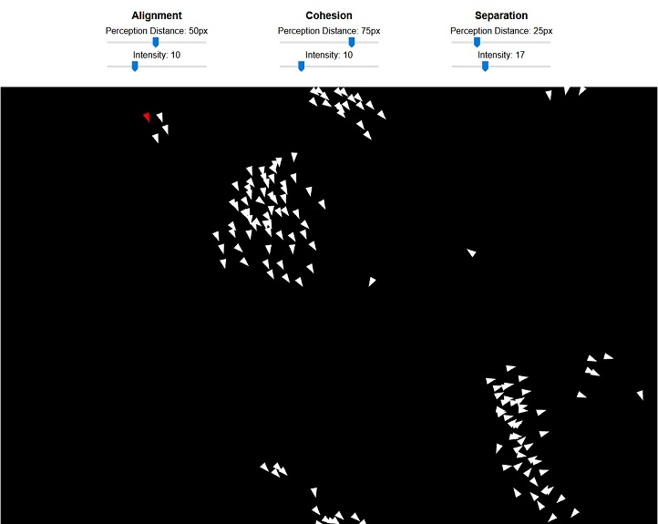

# My implementation of Craig Reynolds' Boids

This is an implementation of Boids, as decribed here <a href="http://www.red3d.com/cwr/boids/"> Official Craig Reynold's website</a> using pure JavaScript for logic and Phaser 3 for graphics.

------

### TODO:
-   Boids quantity selection
-   Obstacles